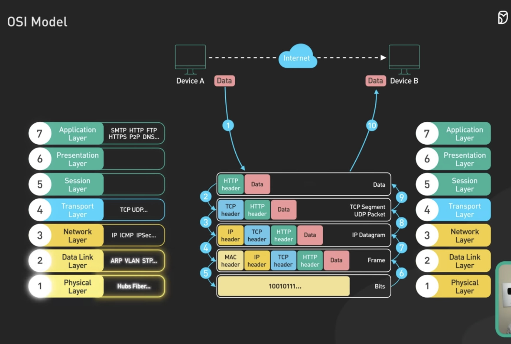

# 
RESEAU

Le reseau permet a des machines interconnectees de pouvoir echanger des donnees.

Le reseau possede 3 types de <y>composants physiques</y> :
 -	<y>les peripheriques de terminaison</y> : ordinateurs, imprimantes, serveurs.
 -	<y>les equipements intermediaires</y> qui servent a interconnecter les peripheriques de terminaison entre eux sur le reseau : routeur et switch.
 -	<y>le support</y> qui transporte les donnees : cable , fibre optique.

### Les reseaux :
<o>PAN et WPAN</o> : Personal area network et Wireless Personal area network, reseau de quelque metre, interconnexion dans une piece (casque, souris...) 

 <o>LAN et WLAN</o> : Wireless Local Area Network, reseau d'une zone restreinte (immeuble, batiment, maison...), interconnextion a l'aide des cables ethernets ou la WIFI.

 <o>MAN</o> : Metropol Area Network, reseau metropolitain qui peut s'etendre a une 10zaine de km, couvre une ville entiere a l'aide des routeurs et des switchs.

 <o>WAN</o> : Wide Area Network, permet d'interconnecter les LAN ou MAN grace a des infrastructures fibre optique, des cables sous-marins et des transmissions par satellite.

---
### IP : 

Une <y>adresse IP</y> est un numero <y>unique</y> attribue a un objet connecte a un reseau informatique. Il peut etre <y>public</y> ou <y>prive</y>(non routable sur internet) </g>

<o>IP (Internet Protocol)</o> : est utilise pour le routage et l'adressage des packets. 

---

### Modele de communication OSI :

<y>7 couches</y> : 

<y>1-Physique (adresse physique)</y>: transfert de donnees en bits, cable ethernet(impulsions electriques), wifi(ondes radios), fibre optique(impulsions lumineuses).

<y>2-Liaison de donnees (adresse MAC)</y>: carte reseau ou wifi (adresse MAC unique), regroupe et stock les donnees binaires dans un cadre(frame). Autre equipement : Switch : contient des interfaces reseaux(ports), tableaux d'adresses MAC, permet connexion des appareils sur un meme reseau local.

<y>3-Reseau (adresse IP)</y>: routage des IP, trouve le bon chemin pour la couche 4

*difference entre 3 et 4 :
en adresses MAC : livraison de saut en saut (equipement en equipement, src et dest peut etre modifie pour atteindre dest final).
en adresse IP : livraison de bout en bout (src et dest non modifiees), en passant par des routeurs.

<y>4-Transport (port)</y>: livraison de service a sercice, TCP(Transfer Control Protocol), UDP(User Datagram Protocol).

<y>5-Session </y>: initier une session avec destinataire afin d'echanger les donees.

<y>6-Presentation </y>: gere la syntaxe et le semantique des infos echangees pour qu'elles soient comprises des deux cotes.

<y>7-Application </y>: Elle fournit une interface pour les utilisateurs pour accéder aux services réseau et aux ressources partagées.

### Les Ports courants :

<y>Port 80 (HTTP)</y> : Utilisé pour les connexions web non sécurisées.  
<y>Port 443 (HTTPS)</y> : Utilisé pour les connexions web sécurisées.  
<y>Port 25 (SMTP)</y> : Utilisé pour l'envoi de courrier électronique.  
<y>Port 22 (SSH)</y> : Utilisé pour l'accès distant sécurisé à des systèmes.  
<y>Port 20 et 21 (FTP)</y> : Utilisé pour le transfert de fichiers via le protocole FTP.  
<y>Port 53 (DNS)</y> : domain Name System. 