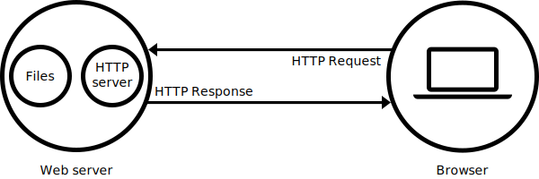

#	
 Serveur Web

## <lb>1-	Definitions :</lb> 

<o>**Page web**</o> : est un document qui peut etre affiche par un navigateur, il est ecrit en <y>HTML</y> et peut inclure diverses autres ressources telles que des <y>feuilles de styles(CSS), des scripts</y> et du <y>contenu multimedia</y>.

<o>**Site web**</o> :  un ensemble de pages web reliees entre elles qui partagent un <y>nom de domaine</y>, chaque page fournit des liens explicites qui permettent a l'utilisateur de naviguer entre les pages web du site.

<o>Serveur web</o> : il peut faire reference a des composants logiciels ou materiels ou les deux qui fonctionne ensemble.

<o>**Hypertext**</o> : document which contents links to others documents, HTML is used to build a hypertext.  

<o>**HTTP**</o> : Hypertext Transfer Protocol, standard rules that define how Hypertext will be shared.

<o>**HTTP server**</o> : web server that receives HTTP requests and can send resources that it has stored.

<o>**World Wide We**</o> : information system that enables content sharing over the internet, making it  easily accessible to the public.

<o>**RFC**</o> : Requests For Comments,  a numbered series of documents describing the technical aspects and specifications of the Internet, or of different computer hardware.

<o>**NGINX**</o> : open source web server.

<o>**URL**</o> : Uniform Resource Locator.

| https:// | www. | google.com | /path/to/file |
| -------- | -------- | -------- | -------- |
| protocol | subdomain | domain name | file path |

<o>fichier .ipp</o> : fichier utilise pour stocker les definitions de fonctions inline*, peut stocker les templates aussi.

**fonction inline* : des fonctions dont le code est inséré directement à l'endroit où elles sont appelées, afin de réduire l'overhead d'appel de fonction.

<o>**socket**</o> : combinaison d'adresse IP et le numero de port.

## <lb>2.	A quoi sert un serveur web ?<lb>

Il sert a servir les pages web aux clients.  
 Au <y>niveau materiel</y>,c'est un ordinateur qui heberge un ou plusieurs sites web et generalement connecte a internet.
  Au <y>niveau logiciel</y>, il controle comment les utilisateurs peuvent acceder aux fichiers heberges.

Le serveur web contient aumoins un serveur HTTP qui utilise le protocol HTTP pour <y>recevoir</y>, <y>traiter</y>, et <y>renvoyer</y> la page demandee par l'utilisateur.  
Le serveur peut etre <y>statique</y> : il livre les fichiers tels quels.  Ou <y>dynamique</y> : les fichier sont mis a jour par un serveur d'application avant d'etre livres.

## <lb>3.	Fonctionnement</lb>

---
## <lb>RFC</lb>

-	7230 : syntaxes des messages HTTP, regles de traitement des messages, IANA considerations.

Format général :

	Requête : Request-Line suivie de header fields, une ligne vide (CRLF).
	Réponse : Status-Line suivie de header fields, une ligne vide (CRLF), et un corps de message (éventuellement).
	Champs d'En-Tête (Header Fields) : Chaque en-tête a un nom suivi de deux points et d'une valeur.
	Les lignes doivent se terminer par une séquence CRLF (Carriage Return suivi de Line Feed, \r\n).

Exemple requete client :

Request-Line : *Methode*, *URI*, *Version*

	GET /index.html HTTP/1.1

Header Fields :

	Host: www.example.com
	User-Agent: Mozilla/5.0 (Windows NT 10.0; Win64; x64) AppleWebKit/537.36 (KHTML, like Gecko) Chrome/91.0.4472.124 Safari/537.36
	Accept: text/html,application/xhtml+xml,application/xml;q=0.9,image/webp,*/*;q=0.8
	Accept-Language: en-US,en;q=0.5
	Accept-Encoding: gzip, deflate, br
	Connection: keep-alive
	Upgrade-Insecure-Requests: 1

Exemple requete serveur :

Status-Line  : *Version*, *Code de statut*, *Raison*

	HTTP/1.1 200 OK

Header Fields :

	Date: Wed, 19 Jun 2024 10:00:00 GMT
	Server: Apache/2.4.41 (Ubuntu)
	Last-Modified: Tue, 18 Jun 2024 15:30:00 GMT
	Content-Length: 3495
	Content-Type: text/html; charset=UTF-8
	Connection: keep-alive

	<!DOCTYPE html>
	/* contenu... */
	</html>

Codes de Statut des Réponses :

	2xx (Succès) : Indiquent que la requête a été reçue, comprise, et acceptée. Exemple : 200 OK
	3xx (Redirections) : Indiquent que le client doit effectuer d'autres actions pour compléter la requête. Exemple : 301 Moved Permanently
	4xx (Erreurs Client) : Indiquent des erreurs dans la requête du client. Exemple : 404 Not Found
	5xx (Erreurs Serveur) : Indiquent que le serveur a échoué à traiter une requête valide. Exemple : 500 Internal Server Error

-	7231 : methodes de requetes, codes de statut des reponses, semantique des entites.
-	7232 : en-tetes de condition, validation et mise en cache, utilisation et comportement des caches.
-	7233 (peut etre pas besoin pour webserv) : spécifie les règles pour la récupération partielle de ressources HTTP à l'aide des en-têtes de plage.
-	7234 :  gestion des caches HTTP et spécifie les règles pour le stockage, la validation et l'invalidation des réponses en cache
-	7235 (peut etre pas besoin pour webserv): définit les règles d'authentification HTTP en spécifiant les schémas d'authentification et les en-têtes associés.

---

## CGI

Common Gateway Interface (littéralement « Interface de passerelle commune »), généralement abrégée CGI, est une interface utilisée par les serveurs HTTP. Au lieu d'envoyer le contenu d'un fichier (fichier HTML, image), le serveur HTTP exécute un programme, puis retourne le contenu généré. 

---

## Ressources

https://developer.mozilla.org/fr/docs/Learn/Common_questions/Web_mechanics/What_is_a_web_server

---

## Outils

<lg>netstat</lg> : commande pour afficher diverses informations sur les connexions réseau, les tables de routage, les statistiques d'interface et d'autres informations relatives au réseau.

<lg>telnet</lg> : un protocole de communication réseau très ancien qui permet à un utilisateur d'établir une session interactive avec un autre ordinateur sur un réseau, typiquement via le protocole TCP/IP. 