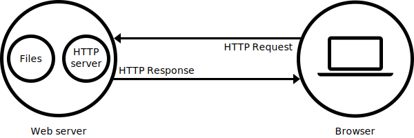

<lb>Questions</lb>  
<lg>Reponse</lg>  
<o>Mots cles</o>  

#	
 Serveur Web

## <lb>1.	Qu'est ce que c'est ?</lb>

<o>**Page web**</o> : est un document qui peut etre affiche par un navigateur, il est ecrit en <y>HTML</y> et peut inclure diverses autres ressources telles que des <y>feuilles de styles(CSS), des scripts</y> et du <y>contenu multimedia</y>.

<o>**Site web**</o> :  un ensemble de pages web reliees entre elles qui partagent un <y>nom de domaine</y>, chaque page fournit des liens explicites qui permettent a l'utilisateur de naviguer entre les pages web du site.

<o>Serveur web</o> : il peut faire reference a des composants logiciels ou materiels ou les deux qui fonctionne ensemble.

## <lb>2.	A quoi ca sert ?<lb>

Il sert a servir les pages web aux clients.  
 Au <y>niveau materiel</y>,c'est un ordinateur qui heberge un ou plusieurs sites web et generalement connecte a internet.
  Au <y>niveau logiciel</y>, il controle comment les utilisateurs peuvent acceder aux fichiers heberges.

Le serveur web contient aumoins un serveur HTTP qui utilise le protocol HTTP pour <y>recevoir</y>, <y>traiter</y>, et <y>renvoyer</y> la page demandee par l'utilisateur.  
Le serveur peut etre <y>statique</y> : il livre les fichiers tels quels.  Ou <y>dynamique</y> : les fichier sont mis a jour par un serveur d'application avant d'etre livres.

## <lb>3.	comment fonctionne t-il ?</lb>

<o>HTTP</o> : 

## Ressources

https://developer.mozilla.org/fr/docs/Learn/Common_questions/Web_mechanics/What_is_a_web_server
